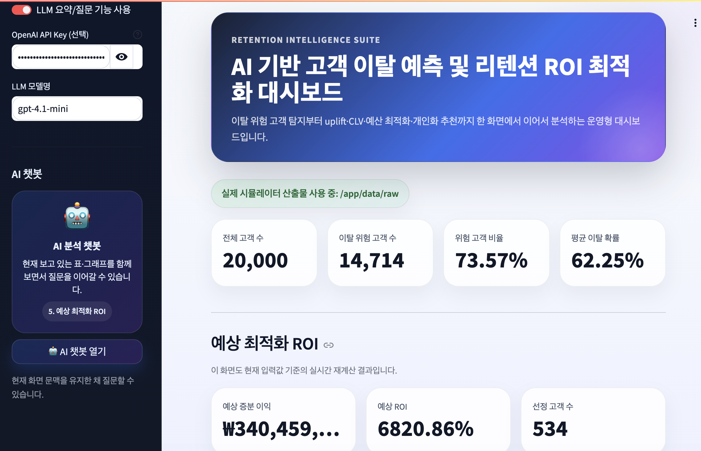
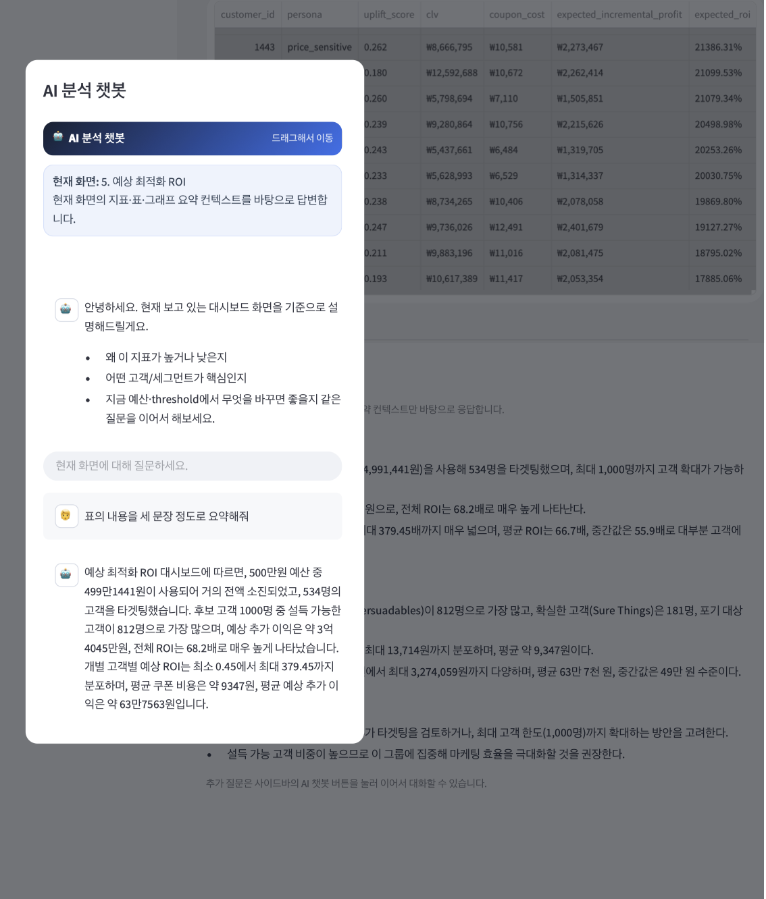

# Retention ROI Project

## Image






## Installment

```bash
pip install -r requirements.txt
```

## Docker Implementation

```bash
docker compose up --build
```

## Simulation Implementation

```bash
python src/main.py --mode simulate
```

## Feature Engineering Implementation

```bash
python src/main.py --mode features
```

Output:

- `data/feature_store/customer_features.csv`
- `data/feature_store/customer_features_metadata.json`
- `results/feature_engineering_summary.json`

## Churn modeling

```bash
python src/main.py --mode train
```

Output:

- `models/churn_model_<best_model>.joblib`
- `results/churn_auc_roc.png`
- `results/churn_precision_recall_tradeoff.png`
- `results/churn_shap_summary.png`
- `results/churn_shap_local.png`
- `results/churn_threshold_analysis.json`
- `results/churn_top10_feature_importance.json`
- `results/churn_metrics.json`

## Uplift + CLV/ Segmentation / Optimization

```bash
python src/main.py --mode uplift
python src/main.py --mode clv
python src/main.py --mode segment
python src/main.py --mode optimize --budget 50000000
```
you're allowed to write whatever budget you have in your mind.

## Personalization / Recommendation

```bash
python src/main.py --mode recommend --budget 5000000 --threshold 0.5 --max-customers 1000
```
you can change the figures (threshod, max-customers)

## AB Test

```bash
python src/main.py --mode abtest

```

## Implementation Order

```bash
python src/main.py --mode simulate 
python src/main.py --mode features
python src/main.py --mode train
python src/main.py --mode uplift
python src/main.py --mode clv
python src/main.py --mode segment
python src/main.py --mode optimize --budget 50000000
python src/main.py --mode recommend --budget 5000000 --threshold 0.5 --max-customers 1000
python src/main.py --mode abtest
docker compose up --build
```

## When You Want To Reimplement

```bash
python src/main.py --mode simulate --force --randomize
python src/main.py --mode features
python src/main.py --mode train
python src/main.py --mode uplift
python src/main.py --mode clv
python src/main.py --mode segment
python src/main.py --mode optimize --budget 50000000
python src/main.py --mode recommend --budget 5000000 --threshold 0.5 --max-customers 1000
python src/main.py --mode abtest
docker compose up --build
```