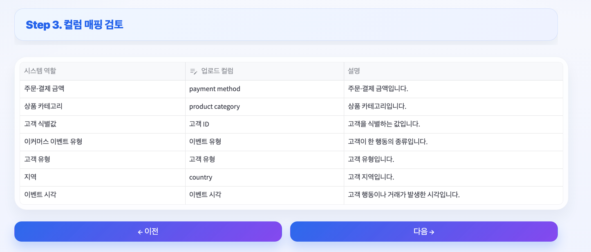
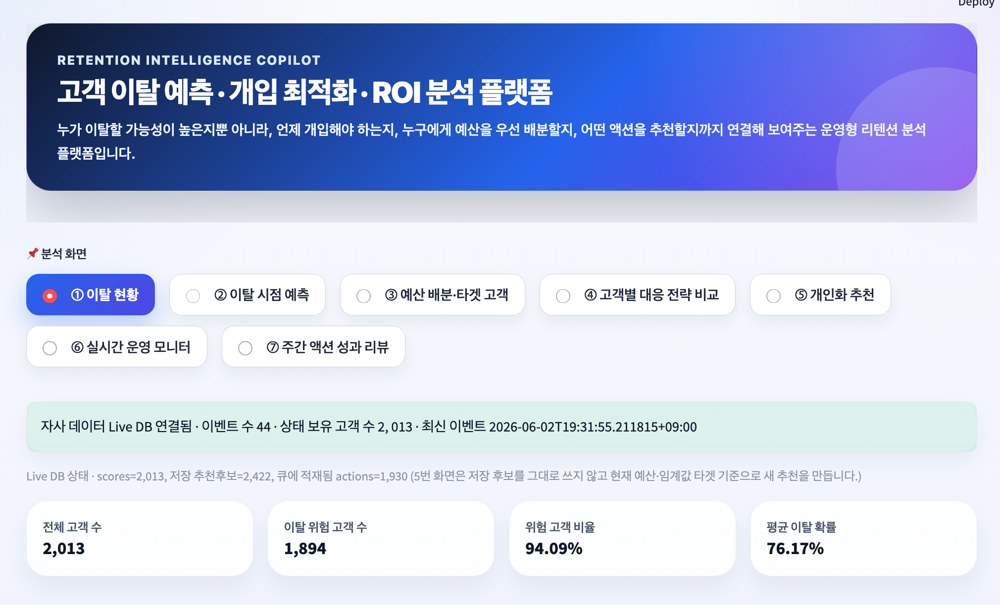

<div align="center">

# Retention ROI Agent

**고객 이탈 예측 - 개입 최적화 - ROI 분석 플랫폼**

CSV 파일 하나로, 누가 떠나는지 / 언제 떠나는지 / 어떻게 잡아야 하는지를 알려줍니다.

[데모 영상](https://github.com/user-attachments/assets/a8b620c8-00bd-4ce2-9d33-da98e79b3fe2) · [발표 자료(PDF)](docs/presentation.pdf) · [기술 문서](docs/technical_guide.md)

</div>

## 개발 배경

마케팅팀은 매달 수천 명의 고객 중 **누구에게, 얼마의 예산으로, 어떤 액션을** 해야 할지 고민합니다.
기존 솔루션은 "이탈 확률 Top 100"을 뽑아줄 뿐, **예산 대비 효과가 가장 큰 고객**을 골라주지 않습니다.

> "이탈할 것 같은 고객"과 "잡았을 때 수익이 남는 고객"은 다릅니다.

이 플랫폼은 이탈 예측에서 끝나지 않고, **개입 효과(Uplift) x 고객 가치(CLV) x 예산 제약**을 함께 고려해 실제 마케팅 의사결정까지 연결합니다.

---

## 핵심 기능

|     | 기능            | 설명                                                                                    |
| --- | --------------- | --------------------------------------------------------------------------------------- |
| 1   | **이탈 예측**   | 머신러닝 기반 이탈 확률 산출 + 생존 분석으로 _언제_ 이탈하는지 추정                     |
| 2   | **타겟 최적화** | Uplift 모델링과 CLV를 결합해 예산 내 ROI를 극대화하는 고객 선별                         |
| 3   | **개인화 추천** | 고객별 최적 액션(쿠폰, 상담, 상품 안내 등)과 그 이유를 제시                             |
| 4   | **실시간 운영** | PostgreSQL 기반 라이브 모드 — 새 이벤트 유입 시 점수와 액션 큐 자동 갱신                |
| 5   | **AI 챗봇**     | 대시보드 화면을 보며 "왜 이 지표가 높은지", "예산을 바꾸면 어떻게 되는지" 자연어로 질문 |

---

## 작동 흐름

```
CSV 업로드 → 컬럼 자동 매핑 → 학습 파이프라인 → 분석 대시보드 → 실시간 운영
```

### **1. CSV 업로드 & 자동 매핑**

자사 데이터를 올리면 컬럼 역할과 이벤트 타입을 자동으로 인식합니다.


### **2. 원클릭 학습**

매핑 확정 후 버튼 하나로 전처리 → 피처 생성 → 모델 학습이 완료됩니다.



### **3. 분석 대시보드**

이탈 현황, 코호트, Uplift+CLV 타겟, 예산 최적화 ROI, 리텐션 대상 목록을 한 화면에서 탐색합니다.



### **4. AI 챗봇**

현재 위험 고객 규모, 예산 집행, 추천 생성, 실시간 액션 큐를 모아보고
AI 챗봇에게 화면 기반 질문을 할 수 있습니다.


---

## 지원 도메인

| 모드              | 대상 산업                  | 데이터 예시                                        |
| ----------------- | -------------------------- | -------------------------------------------------- |
| **금융 모드**     | 은행, 카드사, 핀테크       | 입출금, 대출 상환, 카드 결제, 잔액 변동, 연체 이력 |
| **이커머스 모드** | 온라인 쇼핑몰, 구독 서비스 | 방문, 검색, 장바구니, 구매, 쿠폰 사용              |

어떤 형태의 CSV든 업로드하면 컬럼 역할을 자동 감지하고, 이벤트 값을 내부 표준 타입으로 매핑합니다.

---

## 기술 스택

| 영역        | 기술                                        |
| ----------- | ------------------------------------------- |
| Frontend    | Streamlit                                   |
| Backend API | FastAPI, PostgreSQL                         |
| ML Pipeline | scikit-learn, XGBoost, lifelines(생존 분석) |
| Infra       | Docker Compose                              |
| AI 챗봇     | OpenAI API (GPT-4.1-mini)                   |
| 다국어      | 한국어 / English / 日本語                   |

---

## 빠른 시작

```bash
# 1. 서비스 실행
docker compose up -d --build

# 2. 대시보드 접속
open http://localhost:8501
```

> 상세 설정, API 사용법, 디렉토리 구조는 [기술 문서](docs/technical_guide.md)를 참고하세요.

---

## 문서

| 문서                                                             | 설명                                      |
| ---------------------------------------------------------------- | ----------------------------------------- |
| [기술 문서](docs/technical_guide.md)                             | 설치, API, 디렉토리 구조, 검증 체크리스트 |
| [분석 프로세스와 한계](docs/analysis_process_and_limitations.md) | 분석 흐름 상세 설명 및 알려진 한계점      |
| [피처 사전](docs/feature_dictionary.md)                          | 생성되는 피처 목록과 의미                 |
| [리텐션 전략](docs/retention_strategy.md)                        | 리텐션 전략 프레임워크                    |
| [Counterfactual Lab](docs/counterfactual_retention_lab.md)       | 개입 전략 시뮬레이션 실험                  |
| [발표 자료](docs/presentation.pdf)                               | 프로젝트 최종 발표 슬라이드               |
