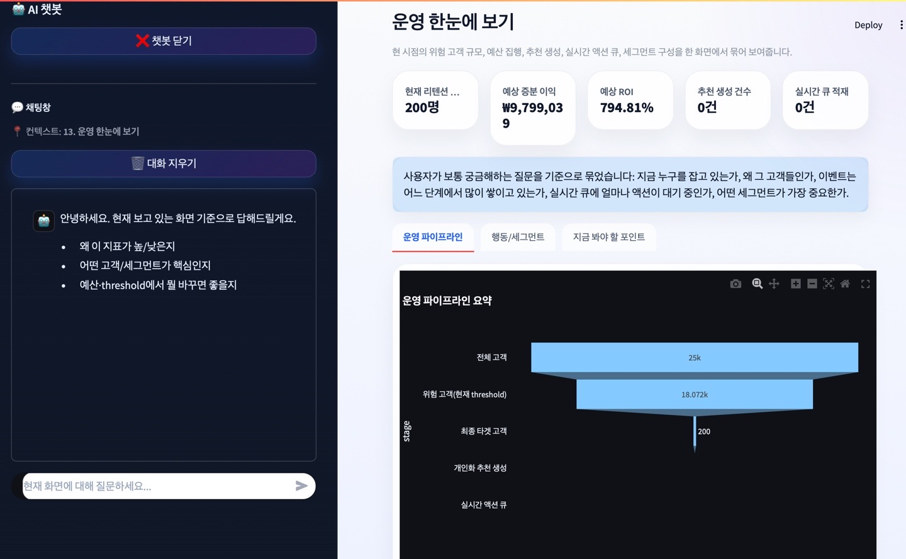
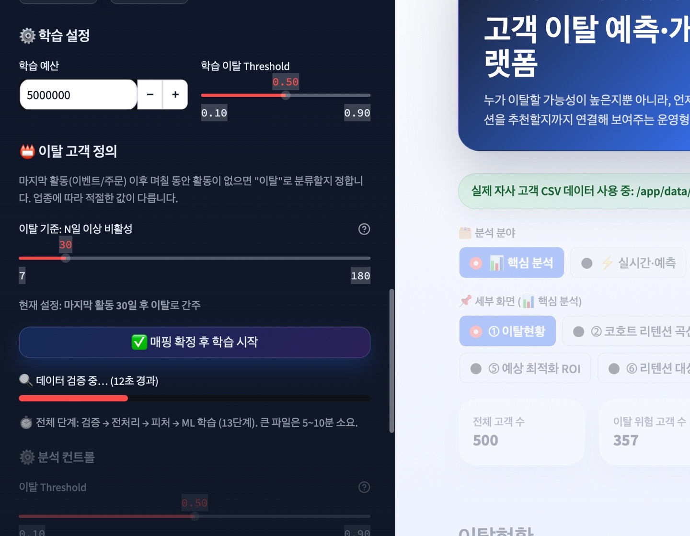
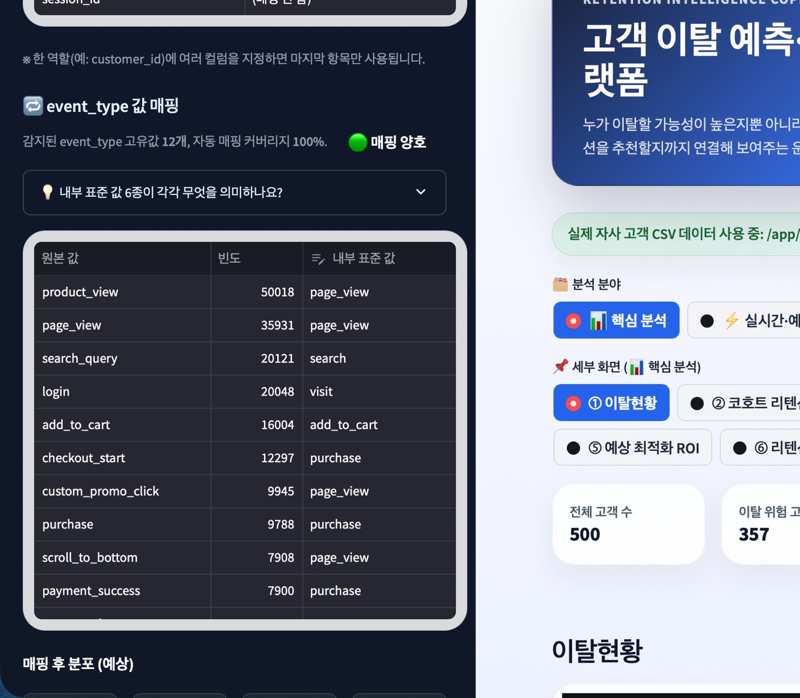
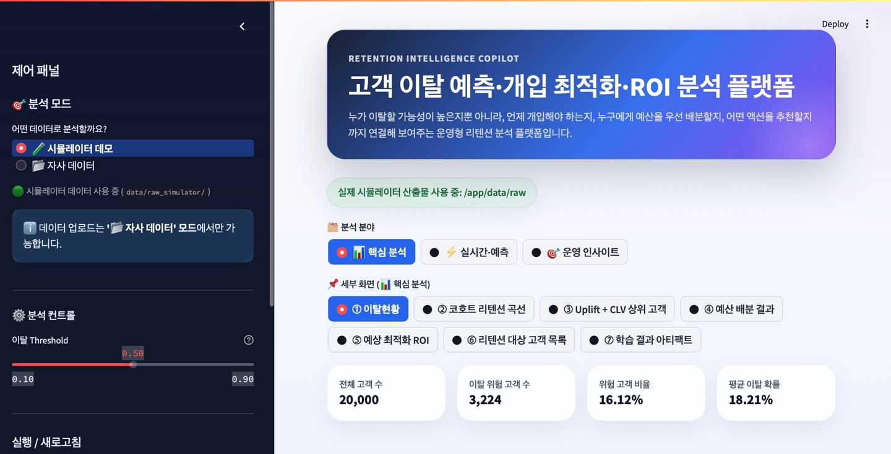

# Retention ROI Project

## Project Overview

Retention ROI Project is a data-driven decision system that covers the full retention workflow: **customer churn prediction, intervention strategy optimization, personalized recommendations, and real-time operations**.  
Rather than only predicting _who_ will churn, this system estimates **_when_ churn is likely to happen**, **_which_ offer should be given to _which_ customer for maximum ROI**, and **identifies the optimal execution priority under budget constraints**.

This project supports:

- Customer behavior analysis using simulated data
- Churn modeling and survival analysis for churn timing estimation
- Uplift, CLV, and segmentation-based targeting with budget optimization
- Customer-level action recommendations with operational explainability
- Strategy validation through A/B testing and simulation fidelity checks
- Pre-deployment validation through real-time replay pipelines

In short, this project is an end-to-end **Retention Decision Intelligence Pipeline** that helps marketing and CRM teams execute retention strategies based on data rather than intuition.

## Image












## Installment

```bash
pip install -r requirements.txt
```

## Docker Implementation

```bash
docker compose up --build
```

## Simulation Implementation

```bash
# Generate synthetic customer behavior data
python src/main.py --mode simulate
```

## Feature Engineering Implementation

```bash
# Build customer-level feature store
python src/main.py --mode features
```

Outputs:

- `data/feature_store/customer_features.csv`
- `data/feature_store/customer_features_metadata.json`
- `results/feature_engineering_summary.json`

## Churn modeling

```bash
# Train churn prediction models
python src/main.py --mode train
```

Outputs:

- `models/churn_model_<best_model>.joblib`
- `results/churn_auc_roc.png`
- `results/churn_precision_recall_tradeoff.png`
- `results/churn_shap_summary.png`
- `results/churn_shap_local.png`
- `results/churn_threshold_analysis.json`
- `results/churn_top10_feature_importance.json`
- `results/churn_metrics.json`

## Survival Ananlysis

```bash
# Estimate churn timing (time-to-event)
python src/main.py --mode survival
```

Runs the survival analysis pipeline to estimate **_when_ each customer is likely to churn**, not just whether they will churn.

This step produces **time-aware churn signals** such as expected churn timing, hazard-related outputs, and intervention windows that can later be integrated into the _optimization_ and _recommendation_ stages.

## Uplift + CLV / Segmentation / Optimization

```bash
python src/main.py --mode uplift
python src/main.py --mode clv
python src/main.py --mode segment
python src/main.py --mode optimize --budget 50000000
```

_you're allowed to write whatever budget you have in your mind._

## Personalization / Recommendation

```bash
python src/main.py --mode recommend --budget 5000000 --threshold 0.5 --max-customers 1000
```

_you can change the figures (threshod, max-customers)_

### 🔍 Operational explainability

```bash
# Generate human-readable explanations for decisions
python src/main.py --mode explain
```

Creates **operational explanation artifacts** for selected or high-priority customers.
This stage summarizes _why_ a customer is risky, _why_ intervention is recommended, and _what_ guardrails should be considered.

Main outputs:

- `results/customer_operational_explanations.csv`
- `results/customer_operational_explanations_summary.json`
- `results/customer_operational_explanations.md`

## AB Test

```bash
python src/main.py --mode abtest

```

## Simulation fidelity audit

```bash
python src/main.py --mode fidelity
```

Audits whether the simulator behaves **realistically** enough for downstream experimentation.
This includes treatment/control balance, funnel consistency, churn-risk alignment, and discount-pressure diagnostics.

Main outputs:

- `results/simulation_fidelity_summary.json`
- `results/simulation_fidelity_report.md`

## Realtime Bootstrap

```bash
python src/main.py --mode realtime-bootstrap
```

Initializes the real-time scoring environment before replaying or consuming streaming events.

This step typically prepares the required state, caches, intermediate artifacts, or message-stream resources so that the real-time pipeline can start from a consistent baseline.

## Realtime Replay

```bash
python src/main.py --mode realtime-replay --stream-limit 20000 --stream-max-events 20000
```

Replays simulated or stored customer events through **the real-time pipeline** so the system can update churn-risk-related outputs as if events were arriving live.

Parameter meaning:

`--stream-limit 20000`
Limits _how many_ customers or records are taken into the replay process.

`--stream-max-events 20000`
Limits the _total number_ of streamed events processed during replay.

## Detached Docker Run

```bash
docker compose up -d --build
```

Builds the Docker images and starts the services in detached mode, which means the containers run in the background.

Difference from:

```bash
docker compose up --build
```

`up --build`: runs in the foreground and shows logs directly in the terminal

`up -d --build`: runs in the background so you can continue using the terminal

## Implementation Order

```bash
python src/main.py --mode simulate
python src/main.py --mode features
python src/main.py --mode train
python src/main.py --mode survival
python src/main.py --mode uplift
python src/main.py --mode clv
python src/main.py --mode segment
python src/main.py --mode optimize --budget 50000000
python src/main.py --mode recommend --budget 5000000 --threshold 0.5 --max-customers 1000
python src/main.py --mode explain
python src/main.py --mode abtest
python src/main.py --mode fidelity
docker compose up -d --build
python src/main.py --mode realtime-bootstrap
python src/main.py --mode realtime-replay --stream-limit 20000 --stream-max-events 20000
```

## When You Want To Reimplement

```bash
python src/main.py --mode simulate --force --randomize
python src/main.py --mode features
python src/main.py --mode train
python src/main.py --mode survival
python src/main.py --mode uplift
python src/main.py --mode clv
python src/main.py --mode segment
python src/main.py --mode optimize --budget 50000000
python src/main.py --mode recommend --budget 5000000 --threshold 0.5 --max-customers 1000
python src/main.py --mode explain
python src/main.py --mode abtest
python src/main.py --mode fidelity
docker compose up -d --build
python src/main.py --mode realtime-bootstrap
python src/main.py --mode realtime-replay --stream-limit 20000 --stream-max-events 20000
```

## Reimplementation Flags

```bash
python src/main.py --mode simulate --force --randomize
```

This command is used when you want to **regenerate the simulation data** from scratch.

Parameter meaning:

`--force`

Overwrites existing generated files or reruns the simulation even if prior outputs already exist.

`--randomize`

Generates **a new randomized simulation** instead of reusing the same deterministic data configuration.

## User Live DB Mode

User Live DB Mode is the production-style path for uploaded company data. It initializes the static user artifacts into PostgreSQL live serving tables, then updates only changed customers when new customer events arrive.

Core flow:


1. Start Docker services.
2. Upload CSV and generate user artifacts from the dashboard.
3. The dashboard automatically seeds PostgreSQL live tables from `data/raw_user`, `data/feature_store_user`, and `results_user` after "매핑 확정 후 학습 시작" completes.
4. Ingest customer events.
5. Verify `feature_state`, `score`, `recommendation_candidates`, and `action_queue`.
6. Confirm the dashboard uses User Live DB results in 자사 데이터 mode.


### 1. Docker

```bash
docker compose up -d --build
```


### 2. Fixed E2E validation routine

Run the whole User Live DB smoke test:

```bash
./scripts/e2e_user_live_check.sh
```

Equivalent manual sequence:

```bash
# 1. live DB 상태 확인
curl -s "http://localhost:8000/api/v1/user-live/health" | python3 -m json.tool

# 2. seed 결과 확인
curl -s "http://localhost:8000/api/v1/user-live/seed-status" | python3 -m json.tool

# 3. 특정 고객 이벤트 발생
curl -X POST "http://localhost:8000/api/v1/user-live/events" \
  -H "Content-Type: application/json" \
  -d '{
    "customer_id": 1001,
    "event_type": "add_to_cart",
    "event_time": "2026-05-10T03:30:00+09:00",
    "amount": 35000,
    "source_event_id": "test-event-1001-001",
    "item_category": "fashion",
    "channel": "web",
    "raw_payload": {"test": true}
  }' | python3 -m json.tool


# 4. 해당 고객 feature_state 확인
curl -s "http://localhost:8000/api/v1/user-live/feature-state?customer_id=1001" | python3 -m json.tool

# 5. 해당 고객 score 확인
curl -s "http://localhost:8000/api/v1/user-live/scores?customer_id=1001" | python3 -m json.tool

# 6. 해당 고객 action_queue 확인
curl -s "http://localhost:8000/api/v1/user-live/actions?customer_id=1001" | python3 -m json.tool
```

All 6 checks should pass consistently before treating the User Live DB MVP as complete.


### Continuous mixed event injection for live demo

This script simulates both existing-customer behavior changes and new-customer acquisition.

- Existing customers are sampled from PostgreSQL `customer_scores`.
- New customers are assigned new `customer_id` values above the current maximum ID.
- Existing-customer events are sent to `/api/v1/user-live/events`.
- New-customer initial behavior sequences are sent to `/api/v1/user-live/events/batch`.
- Each event updates `customer_events`, `customer_feature_state`, `customer_scores`, `recommendation_candidates`, and `action_queue` when scoring/action flags are enabled.

Run this in a separate terminal:

```bash
bash scripts/live_demo_mixed_events.sh
```

### 3. Dashboard verification points

In 자사 데이터 mode, verify these before a PR or presentation:

1. Dashboard reads PostgreSQL `customer_scores` before CSV results.
2. Posting one event changes only the corresponding `customer_id` score path.
3. `action_queue` count increases or the existing row is updated.
4. Refreshing the dashboard preserves values from PostgreSQL.
5. Simulator mode and user mode do not mix. User mode must not fall back to `results/` or `data/raw` simulator artifacts.


Summary:

```markdown
## Summary
- Add PostgreSQL-backed user live mode
- Seed live tables from uploaded user artifacts
- Ingest customer events into customer_events
- Update customer_feature_state incrementally
- Re-score changed customers only
- Refresh recommendation_candidates and action_queue
- Expose user-live API endpoints for dashboard integration

## Validation
- Checked /user-live/health
- Seeded user artifacts into PostgreSQL
- Posted customer event for customer_id=1001
- Verified updated scores and action queue records
```
